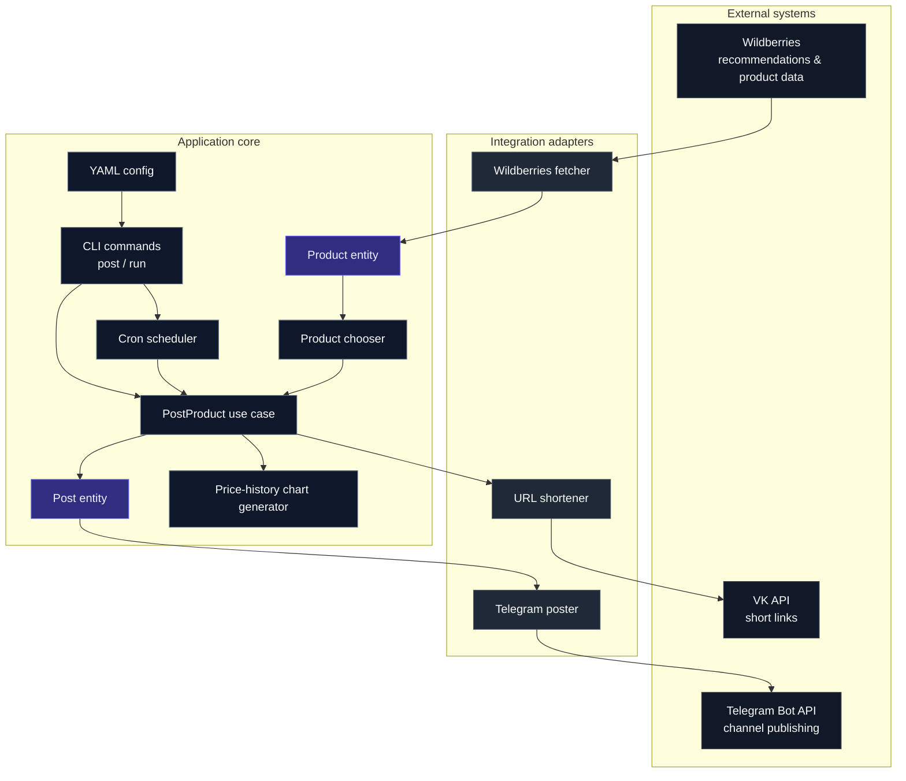
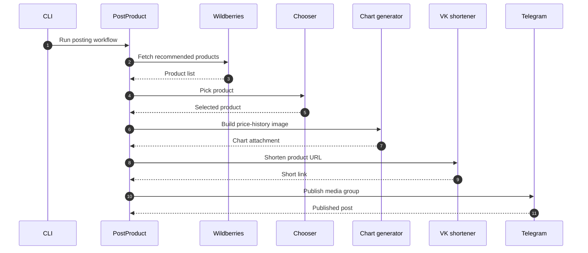
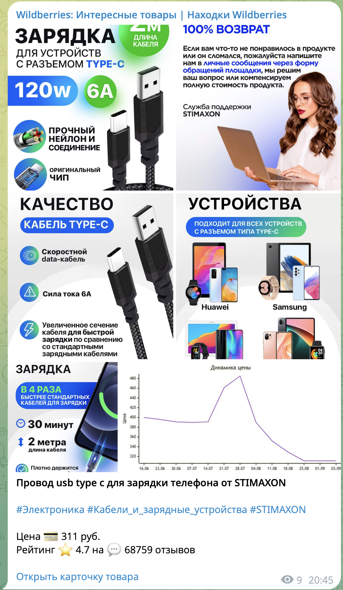

<div align="center">
 <h1>WB Goods Feed</h1>
</div>

<p align="center">
  <a href="https://go.dev/"></a>
  <a href="https://www.docker.com/"></a>
  <a href="https://core.telegram.org/bots/api"></a>
  <a href="LICENSE"></a>
</p>

<p align="center">
  A Go service that turns Wildberries recommendations into scheduled Telegram posts with product images, ratings, tags, price history, and tracked short links.
</p>

---

## What is this?

**WB Goods Feed** is an automation pipeline for publishing random Wildberries products into a Telegram channel.

It is not just a scraper glued to a bot token. The project is structured as a small production-style service: domain entities, use cases, replaceable integrations, CLI entrypoints, cron scheduling, Dockerized runtime, external API handling, and generated price-history visuals.

The result is a compact system that can:

* fetch recommended products from Wildberries;
* choose a random product from the current recommendation feed;
* collect product images, rating, review count, category tags, and price history;
* generate a visual price-history chart;
* shorten product links through VK for cleaner posts and click tracking;
* publish a formatted media group into a Telegram channel;
* run once or continuously on a cron interval.

---

## Why it is interesting

This project demonstrates a practical engineering pattern: take an unstable external data source, normalize it into your own domain model, then deliver a clean publishing workflow through isolated adapters.

The codebase is intentionally small, but the architecture is not casual.

### Engineering decisions

| Area          | Decision                                                               |
| ------------- | ---------------------------------------------------------------------- |
| Language      | Go, for simple deployment and predictable runtime behavior             |
| Runtime       | CLI app with explicit commands                                         |
| Scheduling    | Cron expression from config                                            |
| Deployment    | Multi-stage Docker build and Docker Compose                            |
| Domain model  | Internal `Product`, `Post`, `Image`, `Tag`, and price-history entities |
| Integrations  | Wildberries, Telegram Bot API, VK short links                          |
| Presentation  | Telegram media groups with Markdown captions                           |
| Extensibility | Interfaces for fetching, choosing, posting, and URL shortening         |

---

## Features

### Product discovery

The service requests Wildberries recommendations and maps the response into internal product entities. The application keeps integration details outside the core posting use case, which makes the flow easier to reason about and extend.

### Random product selection

Products are selected through a `Chooser` interface. The default implementation picks a random product from the fetched list.

### Rich Telegram posts

Each post includes:

* product name and brand;
* current price;
* rating;
* review count;
* category hashtags;
* product images;
* link to the product card.

When images are available, the service publishes a Telegram media group. The first image carries the caption, keeping the channel feed clean and readable.

### Price-history chart

When enough price-history data is available, the service generates a Mermaid-based chart image and attaches it to the Telegram post.

This gives subscribers useful context instead of just another product link.

### Link shortening

Product URLs are shortened through VK’s `utils.getShortLink` API. That keeps posts cleaner and makes the link layer explicit.

### Cron-based publishing

The service can run continuously using a cron expression from YAML config:

```yaml
interval: '*/5 * * * *'
```

That means scheduling is controlled by configuration, not hardcoded into the binary.

---

## Architecture

The service is built around a simple rule: **the core use case owns the workflow; integrations stay behind interfaces**.



### Flow



The core flow is built around interfaces, so the main use case does not need to know the implementation details of Wildberries, Telegram, or VK.

---

## Project structure

```text
.
├── cmd/
│   └── wbgoodsfeed/
│       ├── config.example.yaml
│       ├── config.go
│       └── main.go
├── docs/
│   ├── arch.drawio
│   └── arch.png
├── internal/
│   ├── entities/
│   │   ├── feed/
│   │   └── product/
│   ├── integrations/
│   │   ├── telegram/
│   │   ├── vk/
│   │   └── wildberries/
│   ├── shared/
│   │   └── httputils/
│   └── usecases/
│       ├── postproduct.go
│       └── pricehistorychart.tmpl
├── Dockerfile
├── docker-compose.yaml
├── go.mod
└── LICENSE
```

---

## Configuration

Create a config file from the example:

```bash
cp cmd/wbgoodsfeed/config.example.yaml cmd/wbgoodsfeed/config.yaml
```

Example config:

```yaml
interval: '*/5 * * * *'

poster:
  options:
    bot_token_env: TELEGRAM_BOT_TOKEN
    chat_id: -1000000000000

url_shortener:
  options:
    access_token: token
```

### Fields

| Field                                | Description                                                 |
| ------------------------------------ | ----------------------------------------------------------- |
| `interval`                           | Cron expression for scheduled posting                       |
| `poster.options.bot_token_env`       | Environment variable name containing the Telegram bot token |
| `poster.options.chat_id`             | Telegram channel or chat ID                                 |
| `url_shortener.options.access_token` | VK access token for short links                             |

---

## Environment variables

The Telegram bot token is read from an environment variable.

```bash
export TELEGRAM_BOT_TOKEN="your-telegram-bot-token"
```

The variable name itself is configurable through `poster.options.bot_token_env`.

---

## Usage

### Run once

Publish one product and exit:

```bash
go run ./cmd/wbgoodsfeed post -c ./cmd/wbgoodsfeed/config.yaml
```

### Run continuously

Start scheduled publishing using the cron interval from config:

```bash
go run ./cmd/wbgoodsfeed run -c ./cmd/wbgoodsfeed/config.yaml
```

---

## Docker

Build and run with Docker Compose:

```bash
TELEGRAM_BOT_TOKEN="your-telegram-bot-token" docker compose up --build
```

The Compose setup mounts the config file into the container and starts the service in scheduled mode:

```yaml
command: run -c /config.yaml
```

---

## CLI

```text
WB Goods Feed

Commands:
  post    Publish one product immediately
  run     Start scheduled publishing

Flags:
  -c, --config    Path to YAML config file
```

---

## How posting works

1. Load YAML config.
2. Fetch recommended products from Wildberries.
3. Convert external product data into internal domain entities.
4. Pick one product.
5. Collect product images.
6. Fetch and append price-history data.
7. Generate a price-history chart when possible.
8. Build a Telegram-ready post.
9. Shorten the product URL.
10. Publish the post to Telegram.

---

## Example post content



The real post is sent as a Telegram media group when product images are available.

---

## Design notes

This repository is intentionally built around boundaries.

The `usecases` package owns the application flow. Integrations are pushed to dedicated packages. Domain entities stay small and independent. That keeps the codebase easy to inspect, easy to replace, and easy to grow.

For example, replacing Telegram with another publishing target would not require rewriting product fetching. Replacing VK short links would not require touching Wildberries parsing. Changing product selection logic would only require another `Chooser`.

That is the point: small codebase, serious separation of concerns.

---

## Tech stack

* **Go 1.22**
* **Telegram Bot API**
* **Wildberries public endpoints**
* **VK short link API**
* **robfig/cron**
* **urfave/cli**
* **YAML config**
* **Docker**
* **Mermaid image generation**
